# 📚 Anotações sobre a FORMAÇÃO SQL - CURSO 2 - SQL Consultas Avançadas

### Diagramas de Banco de Dados

1. Selecionamos a base de dados -> Diagramas de Banco de Dados -> Botão direito -> Novo Diagrama de Banco de Dados \

2. Selecionamos todas as tabelas para ver os relacionamentos \

3. Nessa tela, podemos visualizar os relacionamentos entre as tabelas do banco de dados \

---

### Consultas Condicionais

## 1. WHERE
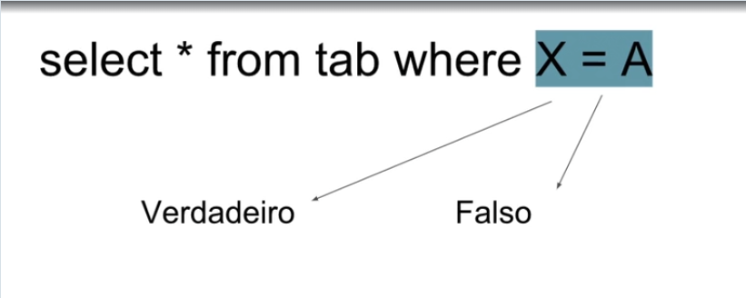

## 2. OR e AND
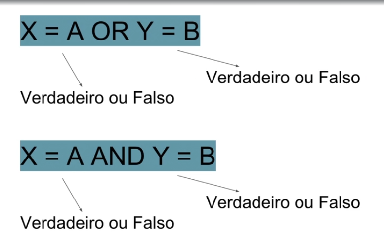
---

---
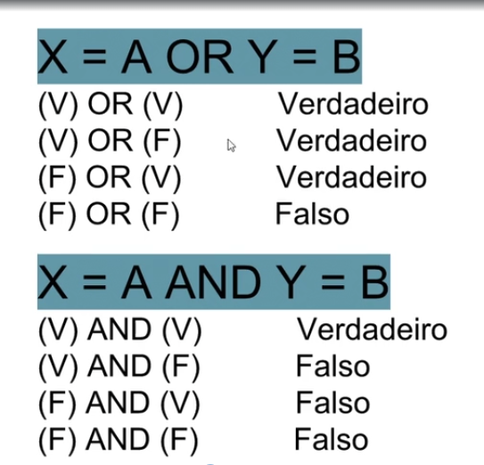

## 3. NOT
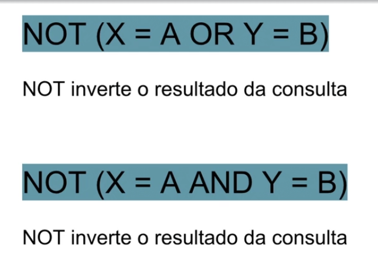
---
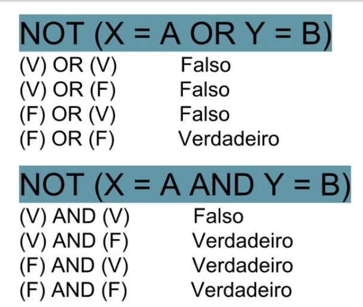

## 4. IN
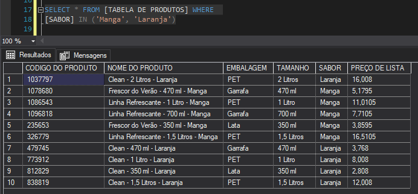

## 5. BETWEEN
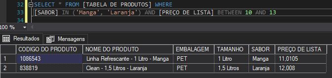

## **Exemplos**

---
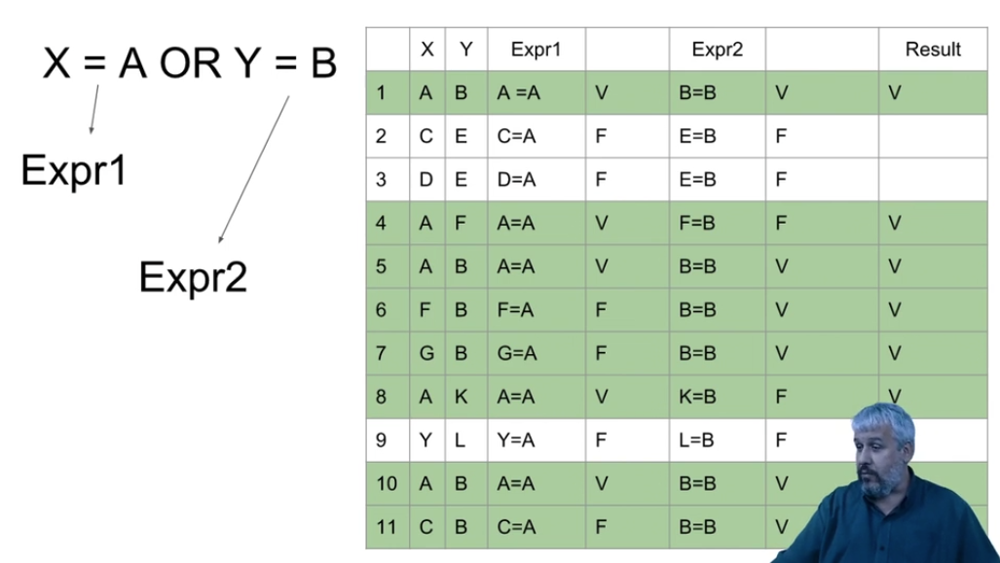
---
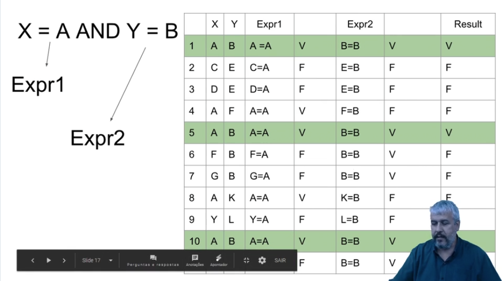
---
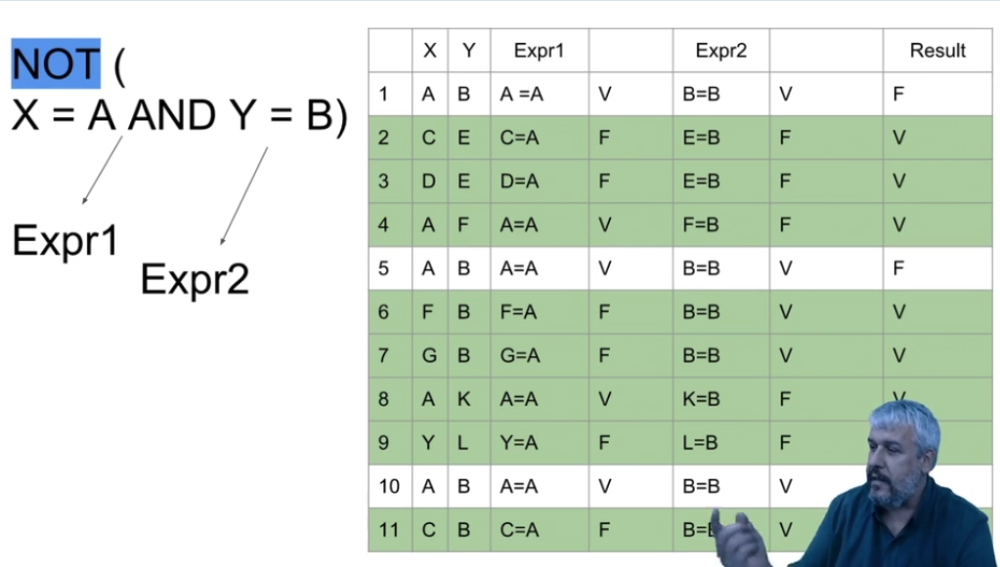
---
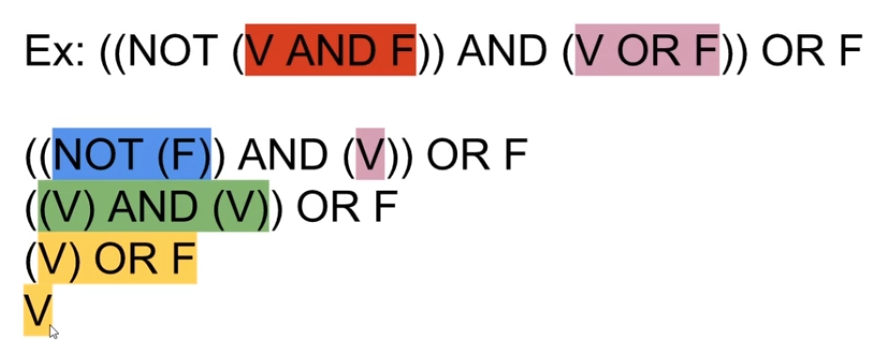

---

### LIKE

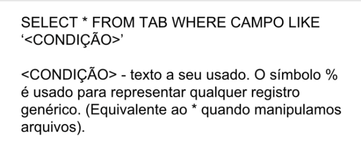
---

---

---

### DISTINCT

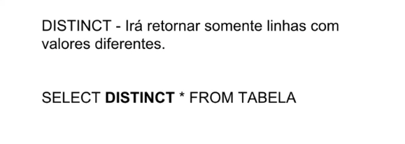

---

### TOP

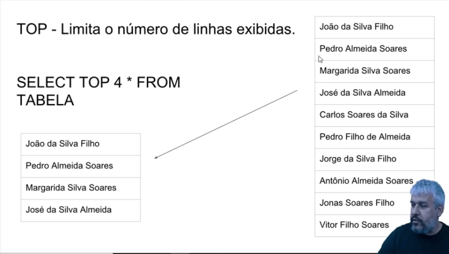

### ORDER BY

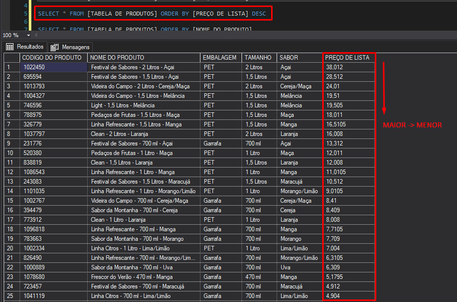
---
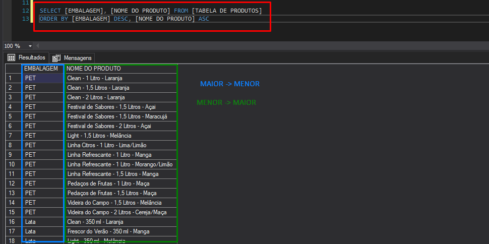

---

### GROUP BY

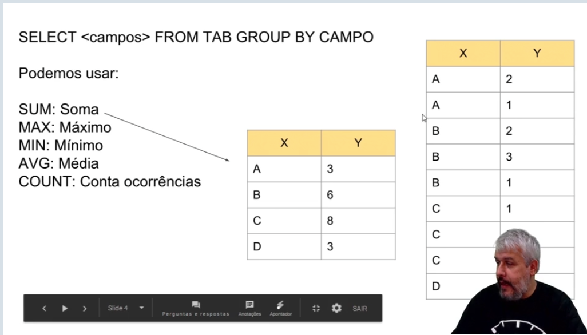
---
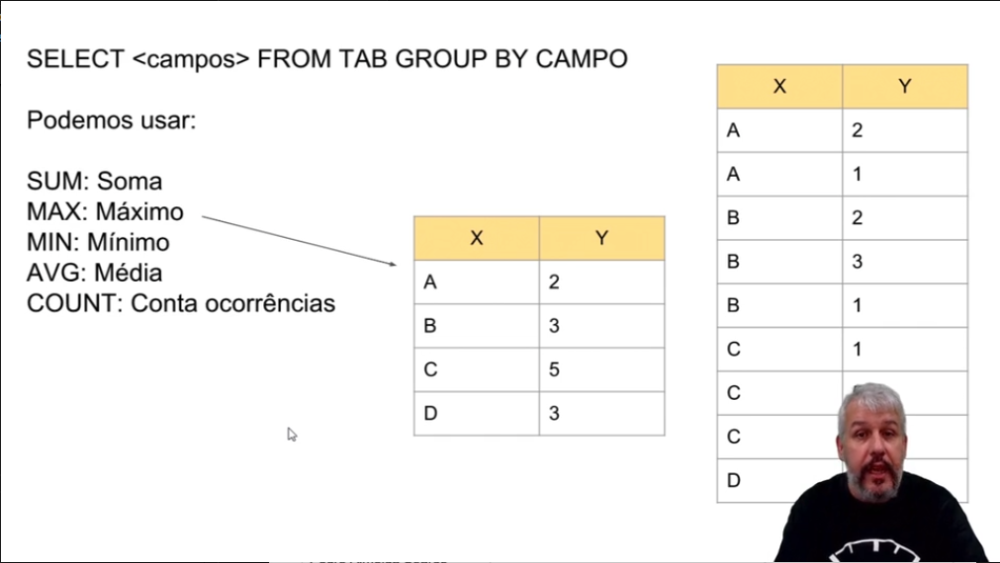
---
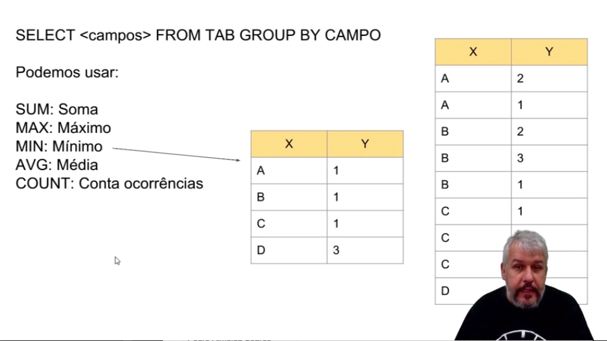
---
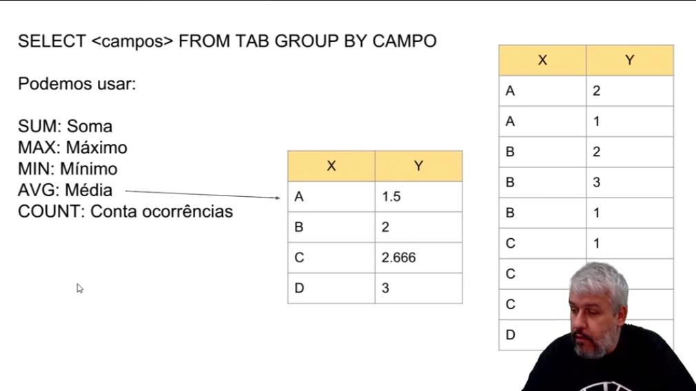
---
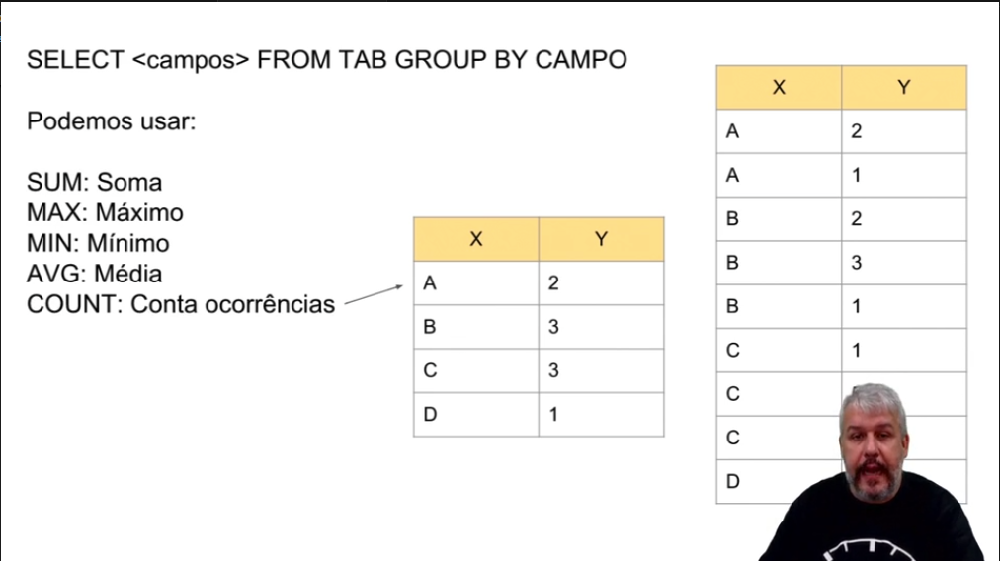

---

### Agregações sem agrupamentos

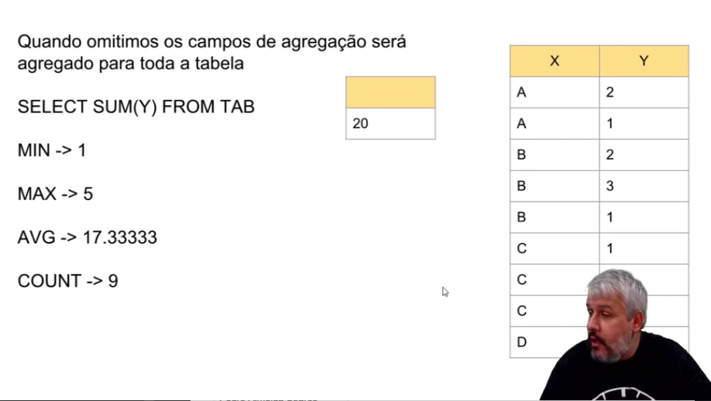

---

### HAVING

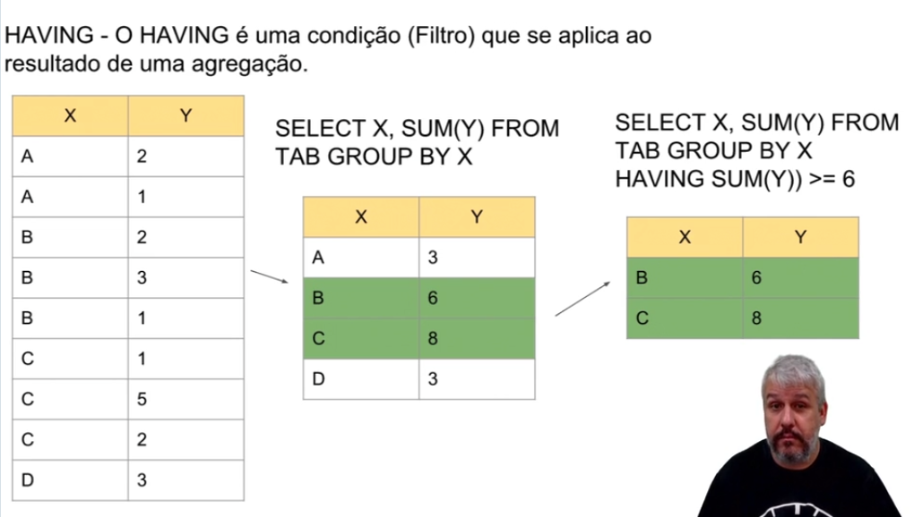

---

## Estruturas condicionais

