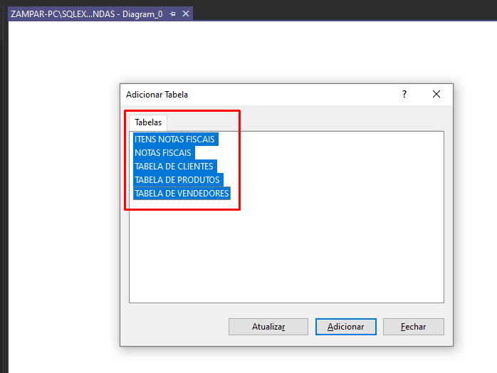
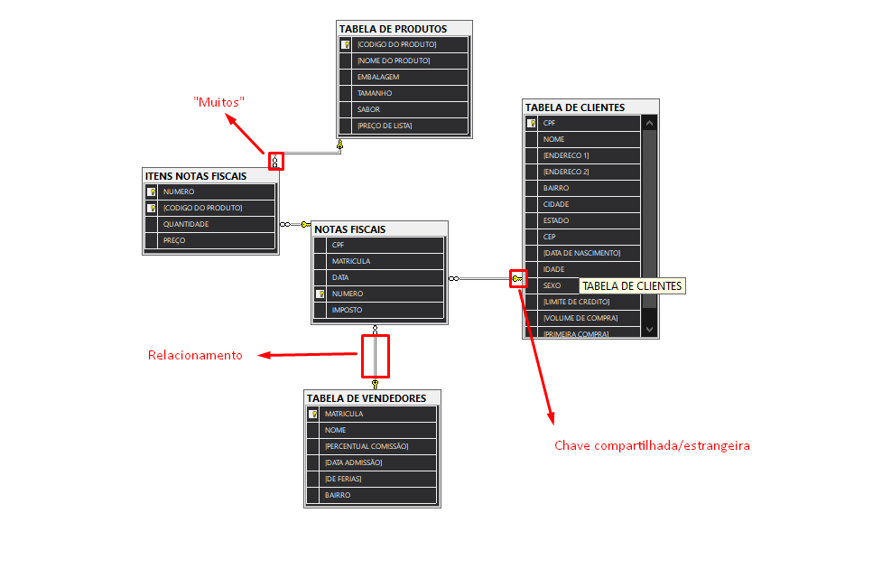

# 📚 Anotações sobre a FORMAÇÃO SQL - CURSO 2 - SQL Consultas Avançadas

### Diagramas de Banco de Dados

1. Selecionamos a base de dados -> Diagramas de Banco de Dados -> Botão direito -> Novo Diagrama de Banco de Dados

2. Selecionamos todas as tabelas para ver os relacionamentos

3. Nessa tela, podemos visualizar os relacionamentos entre as tabelas do banco de dados
