# 📚 Anotações sobre a FORMAÇÃO SQL - CURSO 3 - Manipulação de Dados com Microsoft SQL Server

## Projeto de Banco de Dados
- ### Análise dos requisitos
    - Entendimento das regras de negócio;
    - Efetuar atividades de entrevistas e reuniões;
    - Desenho de modelo mais fiel a realidade;

- ### Modelo conceitual
    - Construção do diagrama de entidade e relacionamento;
    - Estabelecer a cardinalidade das entidades;

- ### Diagrama Entidade-Relacionamento

    >| Cardinalidade       | Notação (Chen) | Notação (UML) | Descrição |
    >|---------------------|---------------|---------------|-----------|
    >| Um para Um (1:1)   | (1,1) - (1,1)  | 1..1 - 1..1   | Uma entidade A está associada a no máximo uma entidade B e vice-versa. |
    >| Um para Muitos (1:N) | (1,1) - (0,N) | 1..1 - 0..*   | Uma entidade A pode se relacionar com várias entidades B, mas uma entidade B só se relaciona com uma A. |
    >| Muitos para Um (N:1) | (0,N) - (1,1) | 0..* - 1..1   | O inverso da cardinalidade 1:N, onde várias entidades A se relacionam com uma única entidade B. |
    >| Muitos para Muitos (M:N) | (0,N) - (0,N) | 0..* - 0..*   | Uma entidade A pode se relacionar com várias entidades B e vice-versa. |

    ### **Exemplo**

    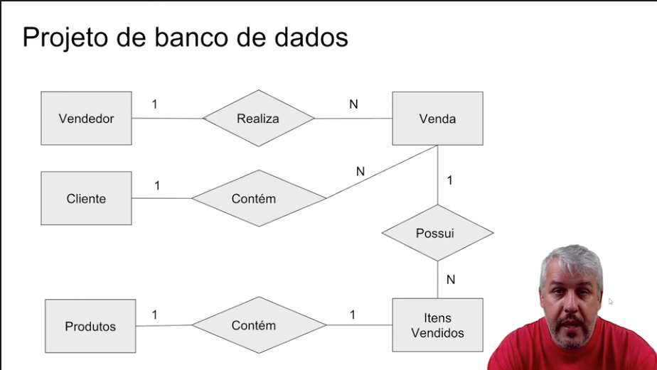

---

- ### Atributos das Entidades
    - Estabelece características de cada entidade

    ### **Exemplo**

    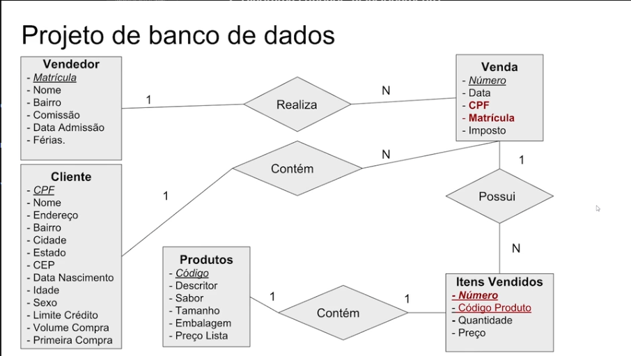

---

- ### Transformar o Diagrama de Entidades em Banco de Dados
    - Transformar cada entidade em uma ou mais tabelas físicas do banco de dados;
    - Cada relação da modelagem será um relacionamento nas tabelas do banco de dados;

    ### **Exemplo**

    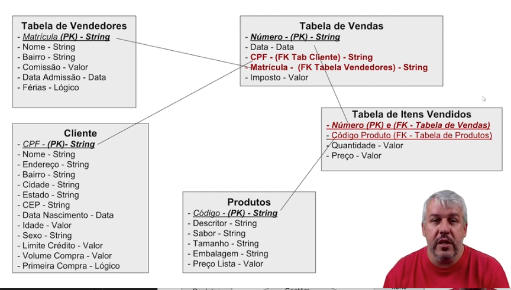

---

- ### Construção do Projeto de Banco de Dados
    - Para essa construção, podemos usar ferramentas CASE (Computer-Aided Software Engineening)
    - **Ex:** Star, UML, Astah, ERWin

---

- ### Parâmetros Principais para a Criação de um Banco de Dados

    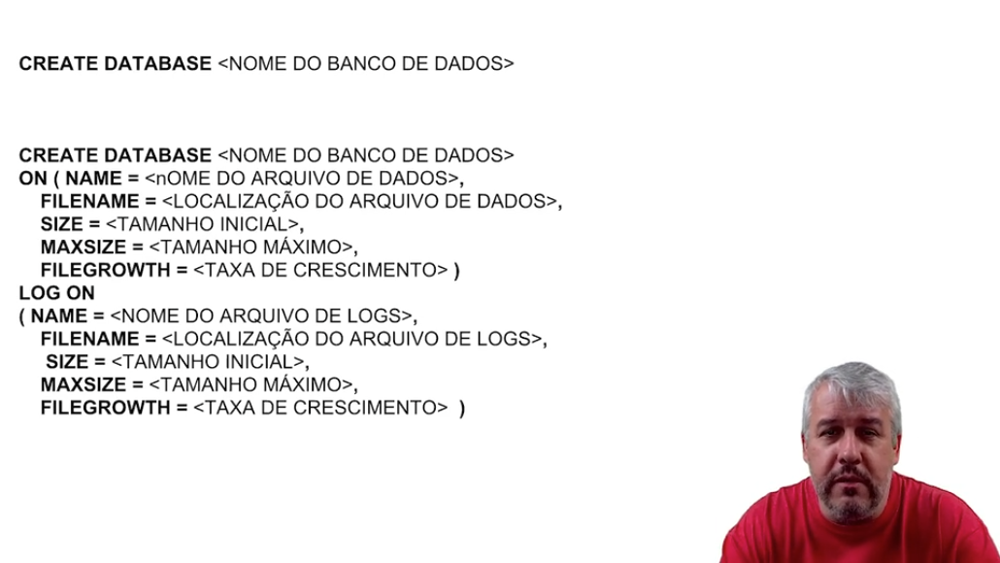

- ### Comando para Deletar um Banco de Dados

    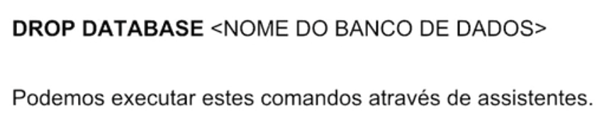

- ### Criação e Exclusão de Tabelas

    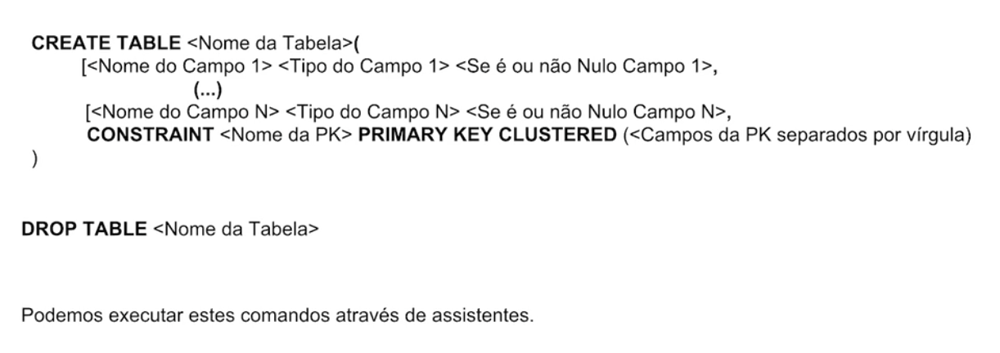

- ### Criação de Relacionamentos entre Tabelas (Foreign Keys)

    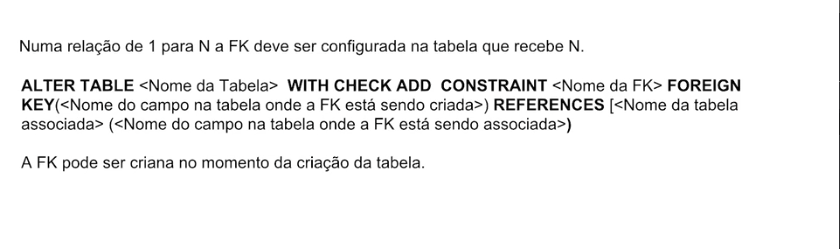

- ### Inclusão de Dados nas Tabelas

    

- ### Alteração de Dados nas Tabelas

    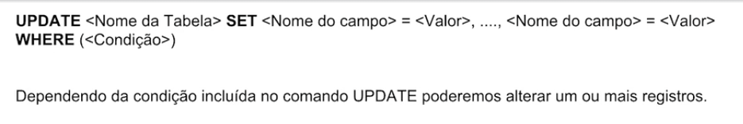

    - ##### **UPDATE FROM**
        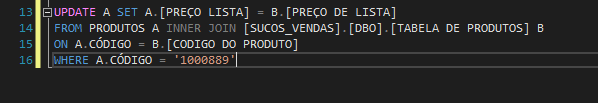

    - ##### **MERGE**
        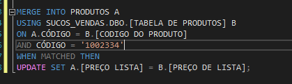

- ### Exclusão de Dados nas Tabelas

    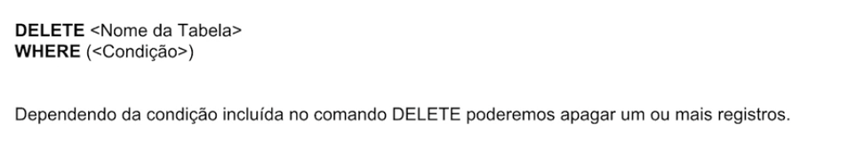

- ### BEGIN TRANSACTION, COMMIT E ROLLBACK

    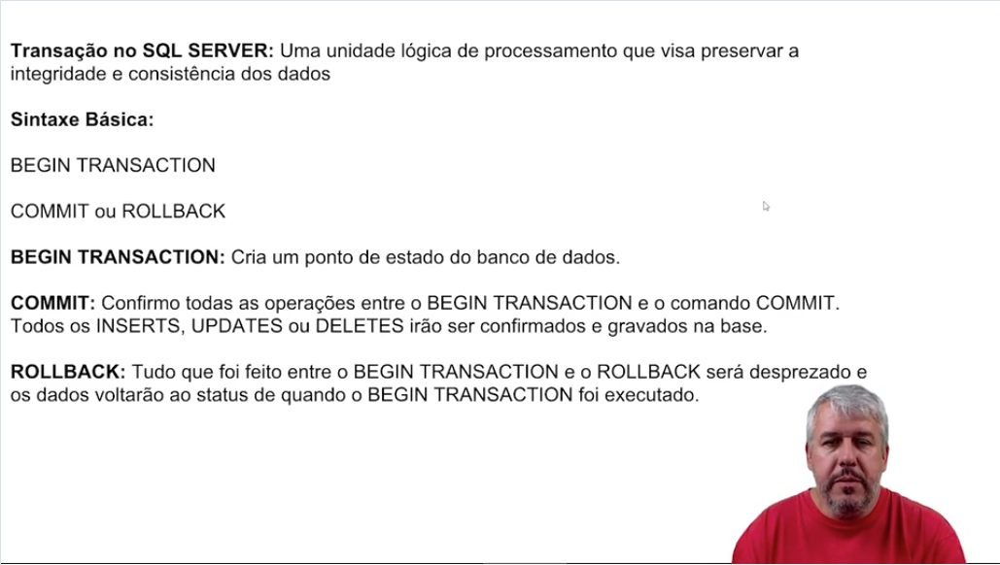
    

    > ## **COMMIT CONFIRMA AS ALTERAÇÕES**

---

- ### Campos com auto-incremento

    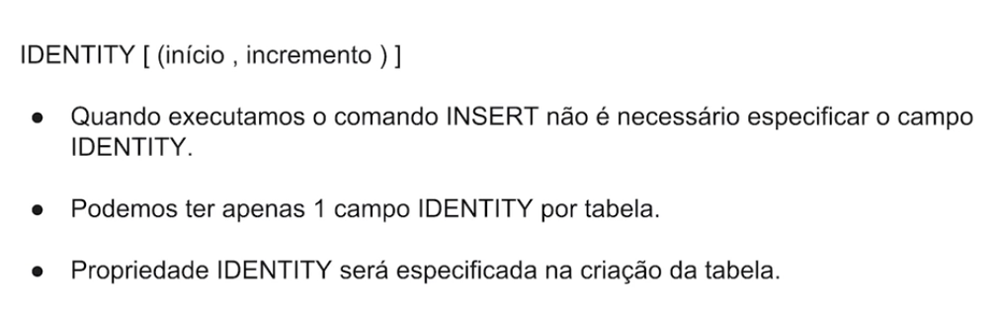
    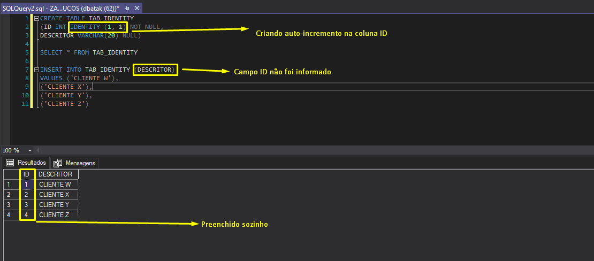

---

- ### TRIGGERs

    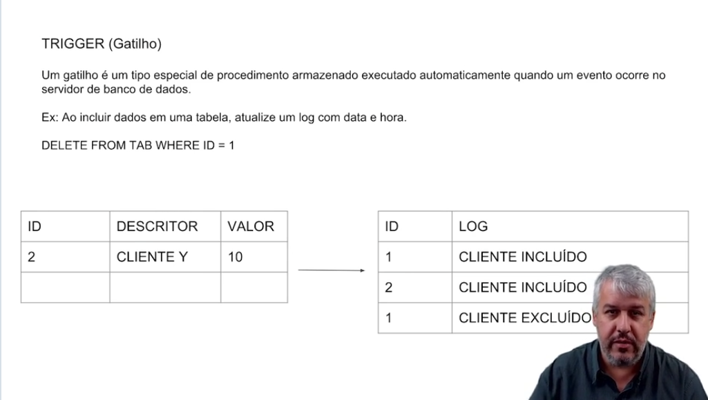

    - #### Sintaxe

        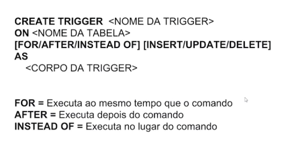

- ### CHECK

    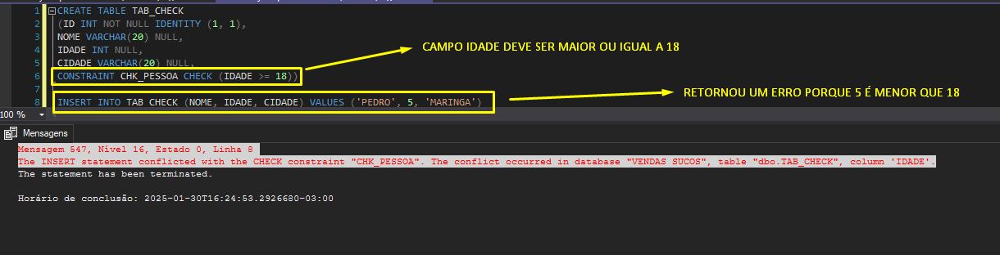