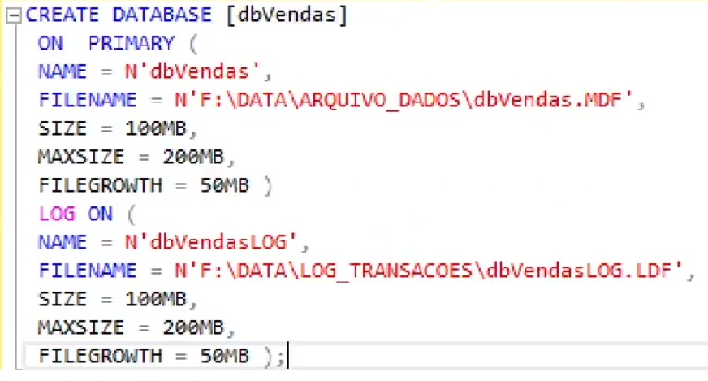
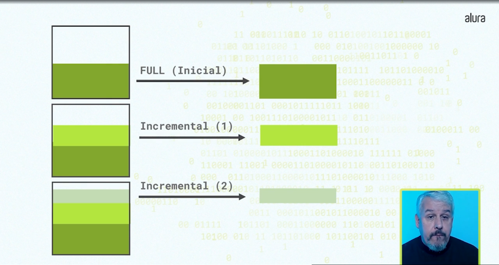
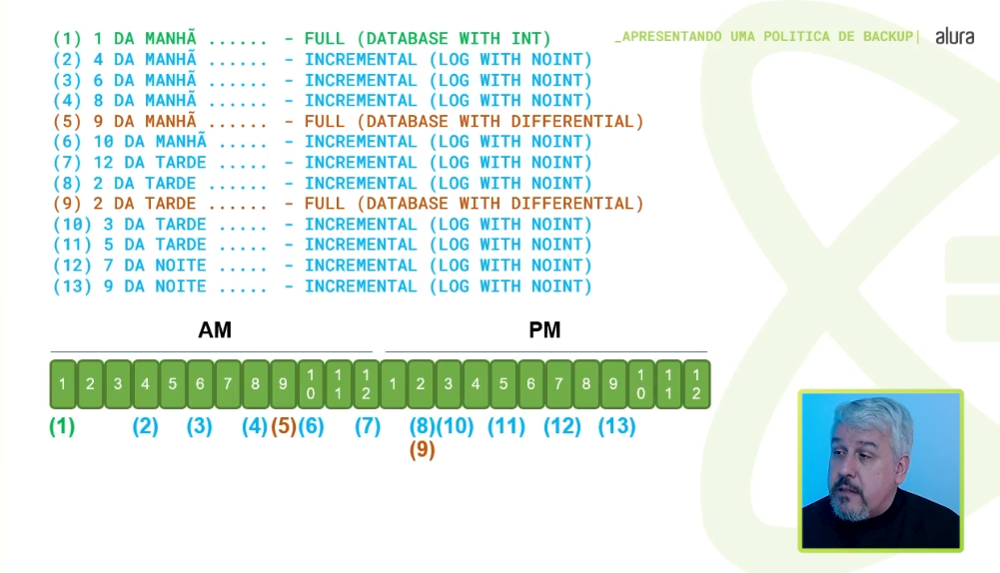

# 📚 Anotações sobre o curso MICROSOFT SQL SERVER 2022 - ADMINISTRANDO O BANCO DE DADOS

## DBA -> DataBase Administrator

### Funções do DBA

- Instalar e configurar o banco de dados
- Monitorar o desempenho
- Gerenciar a segurança
- Realizar backups e recuperação de dados
- Gerenciar a capacidade do banco de dados

> ### Requisitos da base de dados (exercício)
> - A base de dados e de log devem estar em diretórios diferentes
> - Tamanho inicial de 100Mb
> - Tamanho máximo dos arquivos de 200Mb (log e banco)
> - Taxa de crescimento de 50Mb
> 

### Política de Backup
> 
> 