# 📚 Anotações sobre o curso TÉCNICAS FUNDAMENTAIS: GERENCIAMENTO DE CONFLITOS

> ## O que será visto no curso?
> ### Por que ser um gestor de conflitos?
> - Se você é um gestor, você precisa ser um gestor de conflitos
> ---
> ### Habilidades para lidar com conflitos
> - Escuta ativa
> - Paciência e controle das emoções
> - Tomada de decisão
> ---
> ### Características dos conflitos
> - Principais elementos do conflito
> - Tipos de conflitos
> - Oportunidades trazidas pelo conflito
> - Conflitos destrutivos e construtivos
> ---
> ### Modelo de solução de problemas
> 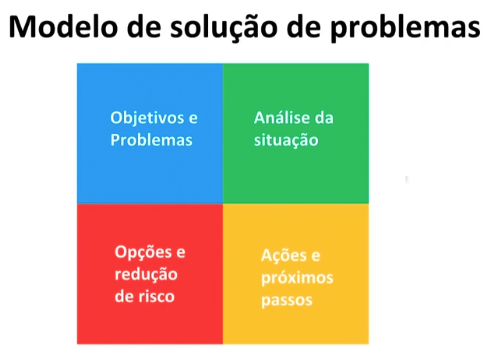
> ---
> ### Comunicação não violenta
> - Observar sem julgar
> - Expressar seus sentimentos
> - Reconhecer suas necessidades
> - Pedir sem exigir
> ---
> ## O que fazer quando o outro lado...
> - É mais poderoso?
> - Usa truques sujos?
> - Não quer negociar?

---

## Habilidades para lidar com conflitos

### 1. Escuta Ativa

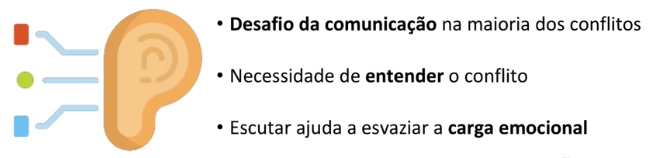

- ### Níveis de Escuta

    1. #### Escuta Interna
        - Visão restrita à nossa participação no todo
        - Foca no que é dito, nas palavras

    2. #### Escuta Focada
        - Foco na empatia
        - Busca entender o que o outro que dizer
        - Consegue perceber as emoções e significados além das palavras

    3. #### Escuta Global
        - Evolução da escuta focada
        - Além das emoções do outro, percebe o ambiente, a postura, analisa as situações
        - Escuta que não julga o outro

- ### Como desenvolver a escuta ativa?

    - Concentrando-se, ouvindo com atenção e sem interrupções
    - Interessando-se genuinamente pelo outro
    - Fazendo perguntas abertas
    - Parafraseando (confirmando o entendimento)
    - Mantendo-se calado na maior parte do tempo
    - **Praticando!**

---

### 2. Paciência e Controle das Emoções

> *"A paciência é companheira da sabedoria."*
> #### — *Santo Agostinho* —

- ### Paciência
    1. Conheça seus gatilhos emocionais e o que te deixa irritado
    2. Estabeleça um padrão profissional para si mesmo
    3. Planeje pausas para descompressão
    4. Relativize o conflito em questão (pense em situações piores que você já passou ou em pessoas que já passaram pela sua situação)

- ### Como os sentimentos ocorrem?
    - O mecanismo do sentimento e sua raiz na preservação da espécie
    - Natureza retroalimentada dos sentimentos

- ### Passos para aumentar o autocontrole
    1. Identificar sinais corporais e pensamentos
    2. Inspire e expire
    3. Nomear o sentimento e escrever em um papel, se possível
    4. Esperar 3 segundos em seu "refúgio", use o relógio do celular
    5. Prosseguir

---

### 3. O que fazer em casos de emergência?

- ### O que fazer quando você perder a cabeça?
    1. Saia do ambiente o mais calmamente que puder e dê uma volta para respirar
    2. Evite a espiral da culpa, não há nada a fazer neste momento
    3. Não culpabilize o outro
    4. Peça desculpas sem tentar justificar seu comportamento
    5. Reflita sobre o que aconteceu e como você pode evitar que ocorra novamente

---

## Oportunidades no conflito

> "... a mudança pode ocorrer tanto por um processo de confronto, que é custoso para os grupos conflitantes, quanto por um processo de resolução de problemas, que é mutuamente recompensador aos grupos conflitantes."
> #### — *Morton Deutsch* —

> O conflito é potencialmente uma oportunidade de mudança

> É um mecanismo de adequação de normas a novas condições

- ### Conflitos construtivos
    > - Prevalência do processo criativo
    > - Pressão e motivação "segura"
    > - Modelo cooperativo de solução de problemas

    ### 1. Fases do pensamento criativo
    1. Problema suficiente estimulante para motivar esforços
    2. Período concentrado para resolver através de ações rotineiras
    3. Frustração pela falha dos processos de costume
    4. Percepção do problema por perspectiva diferente e reformulação
    5. Aparecimento de tentativa de solução, momento de perspicácia, alegria
    6. Elaboração da solução, teste de realidade
    7. Comunicação a público relevante

    ### 2. Pressão e motivação "seguras"
    - Sem medo ou censura
    - Amplitude de ideias e alternativas

    ### 3. Processo cooperativo
    1. Beneficia a comunicação honesta e aberta de informações relevantes
    2. Legitima os interesses do outro e a necessidade de atender ambas as partes
    3. Conduz a atitude amigável, aumenta a sensibilidade, a similaridade e reduz as diferenças
    4. Má percepção benevolente, limita a frequência e a intensidade da oposição experimentada

- ### Conflitos Destrutivos
    > - Expansão e intensificação
    > - Causas iniciais tornarem-se irrelevantes ou esquecidas
    > - Aumento da confiança na estratégia de poder

    - #### Características dos conflitos destrutivos
        - Competição e tentativa de vencer o conflito
        - Má-percepção e percepção enviesada
        - Pressões de consistência cognitiva e social

    > ### As pessoas tendem a agir para justificar suas crenças

    - ### Processo competitivo
        1. Comunicação entre as partes é não-confiante e empobrecida
        2. Visão que a solução do conflito pode apenas ser imposta por força superior, fraude ou esperteza
        3. Atitude hostil que aumenta a sensibilidade às diferenças e ameaças e minimiza a percepção de similaridades

    - #### Problema do incentivo da competitividade
        - Tensão excessiva reduz os recursos intelectuais disponíveis

---

## Modelo de solução de problemas

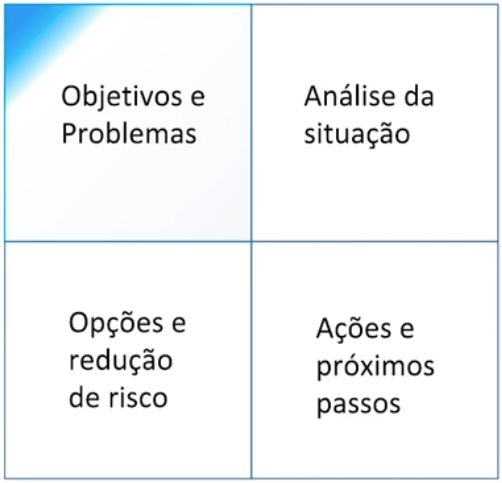

### **Exemplo de conflito  - PARTE 1**
- #### Departamento jurídico em conflito com departamento de vendas
- #### Contrato de grande valor precisa ser liberado como exceção

### Quadrante I - Objetivos e Problemas
#### 1. Objetivos:
- **Curto Prazo**: Liberar o contrato e conseguir reconhecer a renda dentro do mês
- **Longo Prazo**: Garantir que os contratos deste tipo estejam cobertos dentro do padrão da companhia

### Quadrante I - Objetivos e Problemas
#### 2. Problemas:
- **Curto Prazo**
    - Indisponibilidade do departamento jurídico no final de semana
    - Conseguir aprovação do diretor jurídico para o contrato ser emitido
    - Prazo para a assinatura e reconhecimento de renda
- **Longo Prazo**
    - Conseguir simplificar os contratos da empresa incluindo novos modelos de negócio

### Quadrante I - Objetivos e Problemas
#### 3. Partes Interessadas:
- **Empresa**
    - Diretor Jurídico
    - Diretor de Vendas
    - Advogados da empresa
    - Vendedores da empresa
- **Cliente**
    - Representante do cliente que assinará o contrato
    - Comprador no lado do cliente
    - Departamento Jurídico do cliente

### Quadrante I - Objetivos e Problemas
#### 4. Pior Cenário:
- **Empresa**
    - Perdemos esta venda e futuros negócios com este cliente, nossa reputação é impactada
    - Não alcançamos a meta mensal e trimestral
- **Cliente**
    - Corremos o risco de não participar da concorrência em março
    - Podemos não ganhar o mesmo budget para o próximo ano

### Quadrante I - Objetivos e Problemas
#### 5. Preparação:
- 4 horas de preparação do caso
- O vendedor pode obter mais informações com o departamento jurídico do cliente sobre contratos semelhantes
    
---

## Comunicação não violenta

- ### Observar sem julgar
    > "Observar sem avaliar é uma das formas mais elevadas de inteligência humana"
    > #### — *Jiddu Krishnamurti* —

    - #### Por que observar sem julgar?
        - Quando combinamos observação com avaliação, as pessoas tendem a receber isso como crítica

    - #### Exemplos
        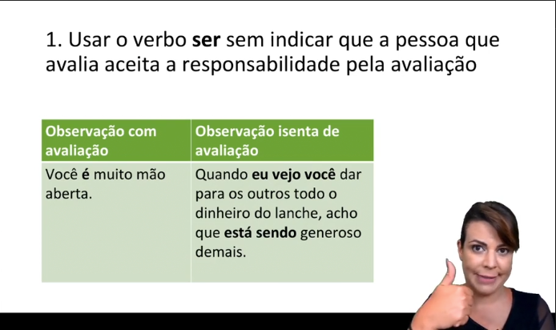
        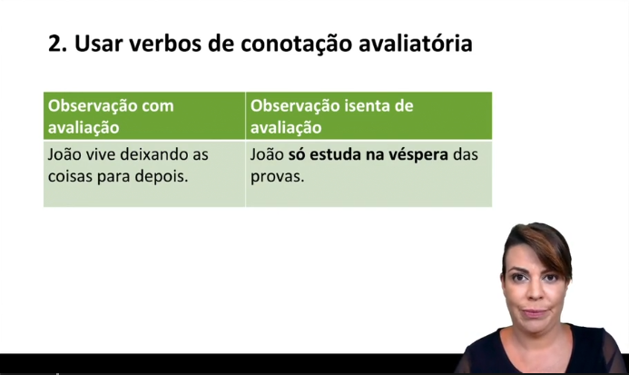
        
        
        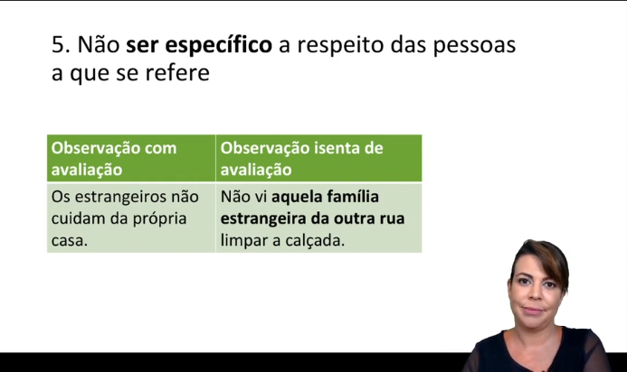
        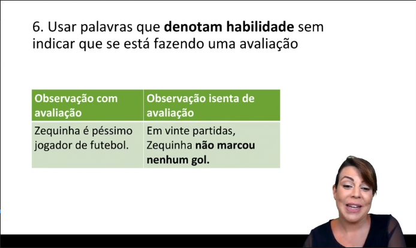
        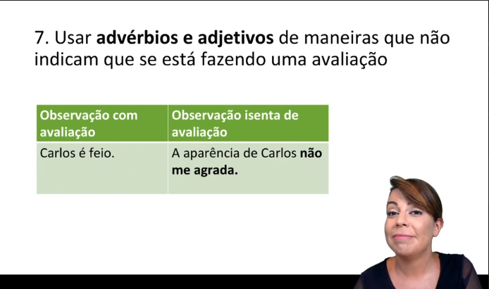

    - #### Palavras-Chave
        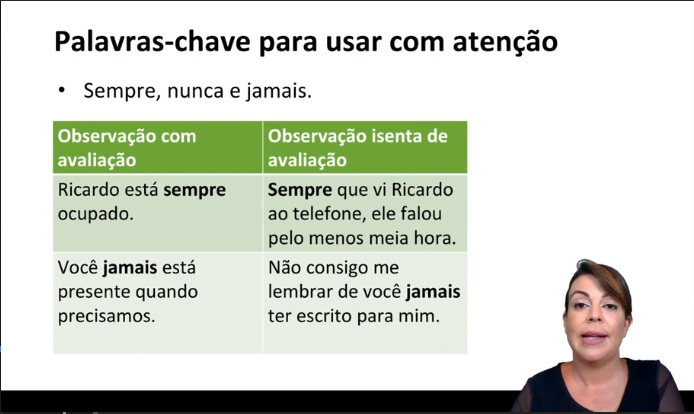
        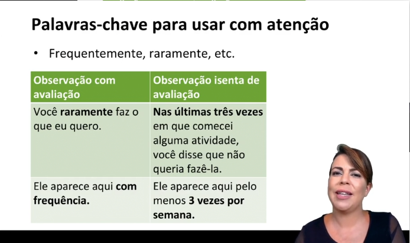

- ### Expressando sentimentos
    - #### Sentimentos universais
        - Tristeza
        - Surpresa
        - Alegria
        - Raiva
        - Desprezo
        - Medo

    - #### Por que é importante expressar corretamente os nossos sentimentos?
        - Expressar nossa vulnerabilidade pode ajudar a resolver conflitos
        - Nos humaniza

    - #### Como diferenciar sentimentos de não-sentimentos?
        - Sentimentos acontecem de dentro para fora
        - Outras pessoas ou eventos podem ser o estímulo para o nosso sentimento, mas não a causa

        - #### Não-Sentimentos
            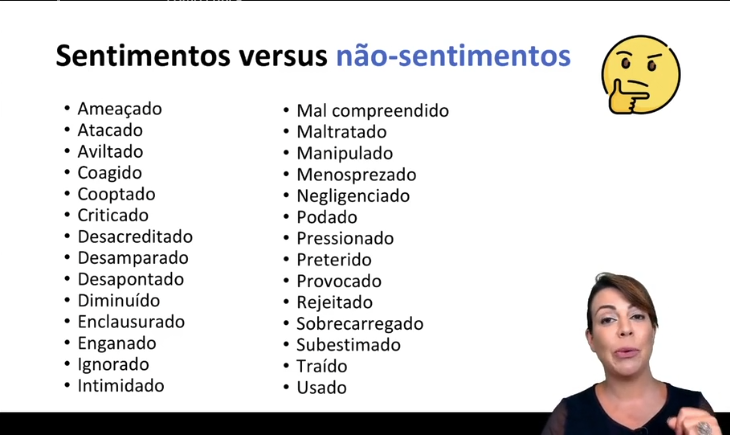
        
        - #### Sentimentos
            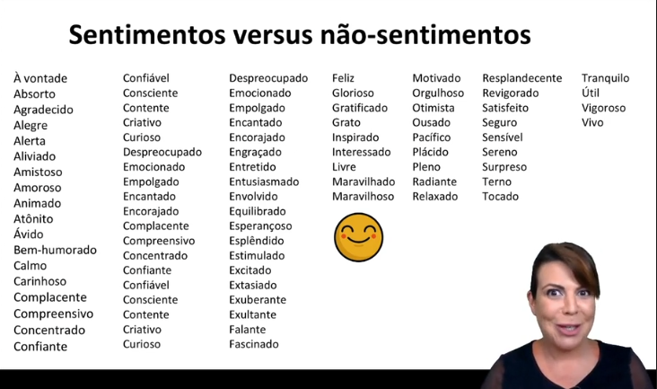

    - #### Confusão semântica
        - Usar o verbo sentir com sentido de penso, acho, creio
            > Palavra "*sentir*" seguida de:
            >    - "que, como, como se"
            >    - que "eu, ele, ela, eles, isso"
            >    - que "nome de alguém"
            >    Exemplos:
            >    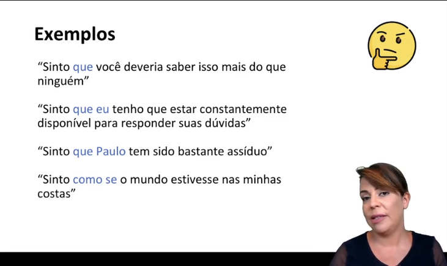

- ### Reconhecendo necessidades

    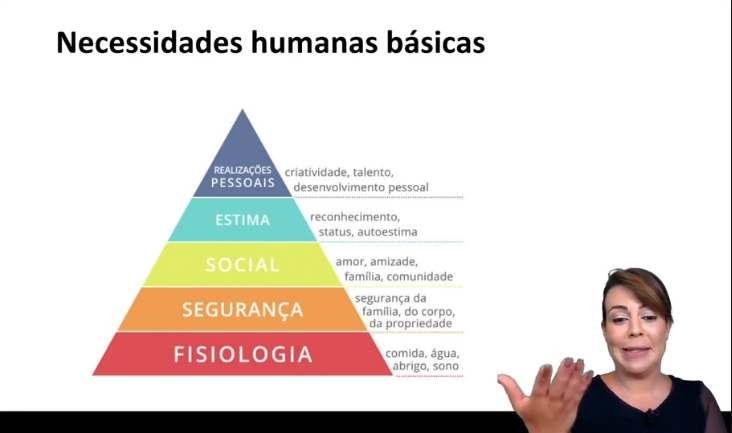

    > ***Quando ouvimos uma mensagem negativa, provavelmente alguma dessas necessidades não foi atendida!***

    - #### Como agir?
        - Ligar nosso sentimento à razão, ao motivo que pelo qual sentimos aquilo:
            - **Ex**: *"Sinto-me assim por que eu..."*
        - Assumir a responsabilidade pelos nossos sentimentos
    
    - #### Como não agir?
        - Mecanismo básico de modelação pela culpa é atribuir o seu sentimento às outras pessoas
        - Pode ser confundido com preocupação positiva, mas é apenas culpa

    - #### Padrões que mascaram a responsabilidade pelos sentimentos

        - Uso de expressões e pronomes impessoais como *"algo"* e *"isso"*
            - **Ex**: *"Algo que realmente me enfurece é quando erros de alinhamento aparecem em cartazes nas ruas"*
            - **Ex**: *"Isso me chateia muito"*
        - Afirmações que somente mencionam a ação de outros*
            - **Ex**: *"Quando você não me responde no WhatsApp fico magoado"*
            - **Ex**: *"Mamãe fica muito triste quando você não come os legumes"*

- ### Pedir sem exigir

    - #### Exemplos:
        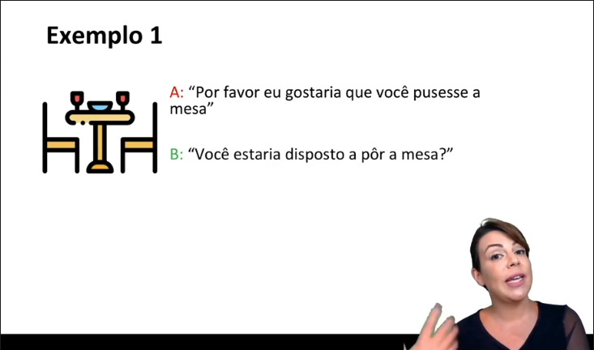
        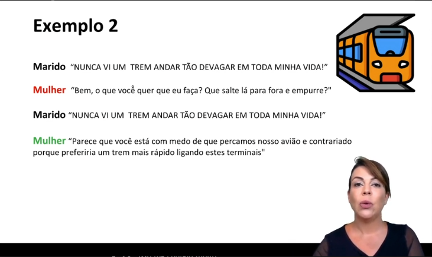
        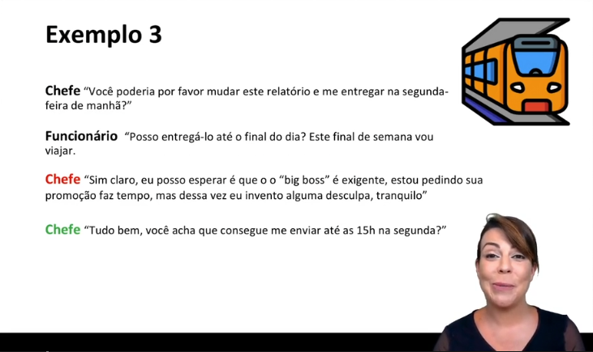

    - #### Como formular seus pedidos?
        - Formular de forma clara, positiva e ações concretas que revelam o que realmente queremos

    - #### Como saber se é um pedido ou uma exigência?
        - Como você vai reagir caso seu pedido seja negado?
            - Culpar, punir ou acusar o outro?

---

## Modelo de solução de problemas

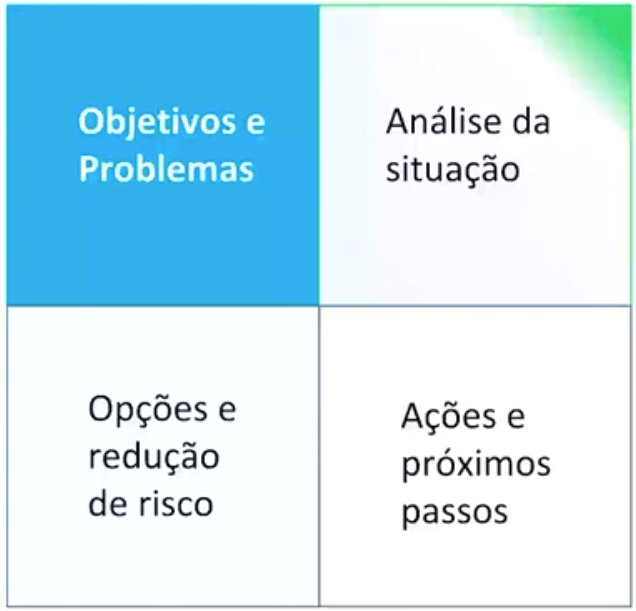

### **Exemplo de conflito - PARTE 2**
- #### Relacionamento prévio advogado-vendedor, vendedor-cliente
- #### Como cada departamento é avaliado

### Quadrante II - Análise da Situação
#### Necessidades/Interesses de ambas as partes:
- #### Racionais
- #### Emocionais
- #### Comuns
- #### Conflituosos

#### 6. Necessidades/Interesses:

- #### Empresa
    - **Departamento Jurídico**
        - Minimizar o risco para a companhia
        - Ser consultado para questões jurídicas
        - Contribuir para o crescimento da empresa
        - Ter seus prazos cumpridos e respeitados
    - **Departamento de Vendas**
        - Alcançar as metas de vendas
        - Ser admirado pelo restante da companhia
        - Contribuir para o crescimento da empresa
        - Ser ajudado pelo backoffice para ter mais tempo com o cliente
- #### Cliente
    - Ter o cliente assinado para poder gastar sua verba dentro do ano
    - Usa a nova tecnologia para participar de uma concorrência pública em março

#### 7. Percepções:

- #### Empresa
    - **Diretor Jurídico - Francisco**
        - "Não podemos mais ser pegos de surpresa, precisamos estar preparados para o mercado"
        - "O Juscelino poderia ter nos informado deste negócio com mais antecedência. Como o jurídico só foi envolvido agora? É uma bagunça!"
    - **Advogado - Rodolfo**
        - "O Juscelino faz o que bem entende porque é amigo do cliente e agora eu é que preciso ficar trabalhando no final de semana!"
        - "Ele poderia ter trazido antes esta situação para vermos juntos. Eu não vou deixar este contrato passar para depois sobrar pra mim!"
    - **Diretor de Vendas - Juscelino**
        - "Carlinhos é fogo, poderia ter me avisado antes que existia esta chance de fechar o negócio, agora estamos na mão do jurídico. Se precisar eu escalo para o CEO!"
    - **Vendedor - Carlinhos**
        - "O chefe manda eu vender serviços com nosso produto, eu vendo e agora sou o vilão!"
        - "Eu não tenho culpa do jurídico não estar preparado!"
        - "Eu sou vendedor, eu vendo! Eles precisam me ajudar."

#### 8. Comunicação:

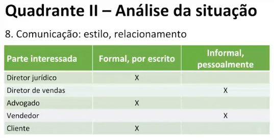

#### 9. Standarts:

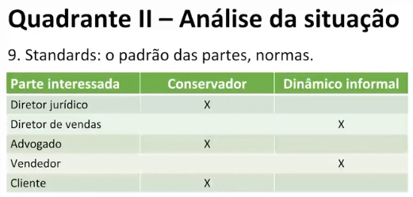

#### 10. Revisar os objetivos:

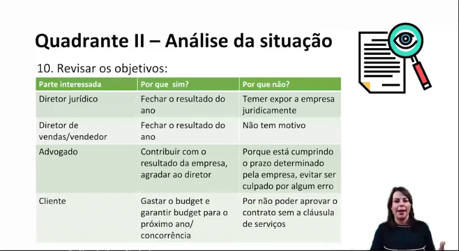

---

## O que fazer quando o outro lado usa truques sujos?

- ### Principais truques sujos
    - #### Fraude
        - Dados falsos
        - Autoridade ambígua
        - Intenções duvidosas
    - #### Guerra psicológica
        - Táticas que visam constranger o outro para que ele tenha um desejo inconsciente de abandonar o conflito e desista
        - Situações tensionantes
        - Mocinho/Bandido
        - Ameaças

---

## O que fazer quando o outro lado é mais poderoso?

- ### Como se proteger?
    - #### Problema do piso mínimo
    - #### Projete um cordão de isolamento

- ### O que é BATNA?
> *Best Alternative To a Negotiated Agreement*
- #### O que farei se tudo isso não der certo?
- #### Como extrair o máximo dos seus recursos?

---

## O que fazer quando o outro não quer negociar?

- ### Por que o outro lado não quer negociar?
    - Tática utilizada para estruturar a negociação do conflito para que apenas um dos lados tenha que fazer concessões

- ### Táticas de pressão posicional
    - #### Exigências extremadas
    - #### Escalada de exigências
    - #### A sócia implacável
    - #### Tática do impedimento
    - #### Atraso calculado
    - #### "É pegar ou largar"

---

## Modelo de solução de problemas

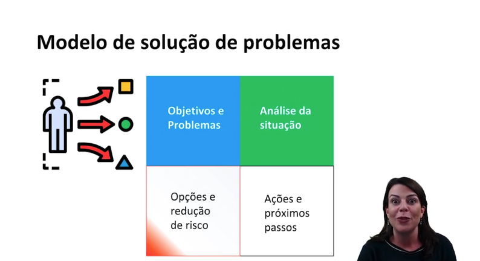

### **Exemplo de conflito - PARTE 3**
- #### Cliente tem mais contratos em andamento com a Solution Tech
- #### Diretor de Vendas já namorou a atual esposa do Diretor do Jurídico

### Quadrante III - Opções de redução de risco

#### 11. Brainstorm
- O que trocar ou interligar nas opções?

- **Curto Prazo**
    - Pedir para o departamento jurídico trabalhar no fim de semana
    - Conseguir aprovação de exceção do diretor jurídico para este determinado contrato

- **Longo Prazo**
    - Criar um "task force para simplificar os contatos"
    - Colocar um vendedor com responsável por ser a "voz" do jurídico em vendas e vice-versa
    - Ter um time jurídico de plantão para exceções de última hora

#### 12. Incrementos
- Analisar os pênaltis mais onerosos no contrato e traçar uma matriz de risco, probabilidade e custo
- Adicionar cláusula que possibilita aditivo ao atual contrato caso novos riscos não identificados surjam

#### 13. Terceiros
- Não há exatamente "inimigos"
- Influenciadores: Diretor de vendas, CEO da companhia

#### 14. Enquadramento
- **Visão**: Satisfazer as duas empresas (nossa empresa e a envolvida na negociação)
- **Perguntas abertas**
    1. Como você vê que poderíamos atender esta demanda?
    2. Qual saída seria a melhor para a nossa empresa neste caso?

#### 15. Alternativas
- É possível quebrar o contrato em dois e assinar apenas o item que não tem controvérsia?
- O cliente não poderia gastar parte da verba de outra forma com a empresa?

---

## Modelo de solução de problemas

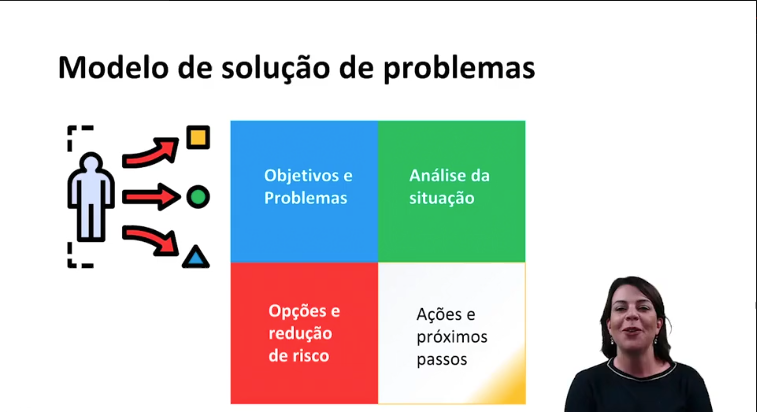

### **Exemplo de conflito - PARTE 4**
- #### Cliente não aceita assinar contrato sem cláusula de serviços
- #### Responsável do cliente que assinará viaja no dia 31 as 13:00h de férias

### Quadrante IV - Ações e próximos passos

#### 16. Melhores opções/prioridades
- #### Melhores opções
    - **Curto Prazo**
        - Diretor aprovar a exceção do contrato

    - **Longo Prazo**
        - Simplificação dos contratos e inclusão de cláusula de serviços

- #### Prioridades
    - **Empresa**
        - Não perder o negócio para o ano

    - **Cliente**
        - Obter o serviço e poder resgatar a verba anual

- #### Dealbreakers
    - **Empresa**
        - Reduzir o preço

    - **Cliente**
        - O cliente não aceitar a cláusula especial de serviços

#### 17. Quem apresenta, quando e para quem?
- **Quem apresenta**: Diretor de vendas
- **Quando**: 29/12 - Sexta-Feira - 16:00h
- **Para quem**: Diretor jurídico

#### 18. Processo: agenda, prazos, gerenciamento do tempo
- Reunião - Dep. de Logística, sexta-feira, 14:00h
- Reunião - Dep. de Faturamento e Impostos, sexta-feira, 15:00h
- Reunião - Diretor Jurídico, sexta-feira, 16:00h
- Reunião - Dep. Jurídico, sexta-feira, 17:00h
- Emissão de contratos até sábado às 20:00h

#### 19. Compromisso/incentivos: Especialmente para a outra parte
- Dep. Jurídico analisará as partes críticas do contrato em tempo hábil para assinatura

#### 20. Próximos passos: Quem faz o que?
- #### Curto prazo
    - **Vendedor**
        - Reunião com o cliente para assinatura do contrato (Domingo 31/12 - 09:00h)

    - **Gerente de faturamento, logística, contabilidade**
        - Acompanhamento do faturamento, entrega e reconhecimento (Domingo ao longo do dia)

- #### Longo prazo
    - **Gerente jurídico e estagiário**
        - Revisar o contrato utilizado para incluí-lo como padrão nos modelos da companhia

    - **Diretor do Dep. Jurídico**
        - Os principais contratos utilizados na empresa serão revisados para sua simplificação

    - **Diretor do Dep. de Vendas**
        - Vendas transferirá parte do seu orçamento para contribuir com força tarefa