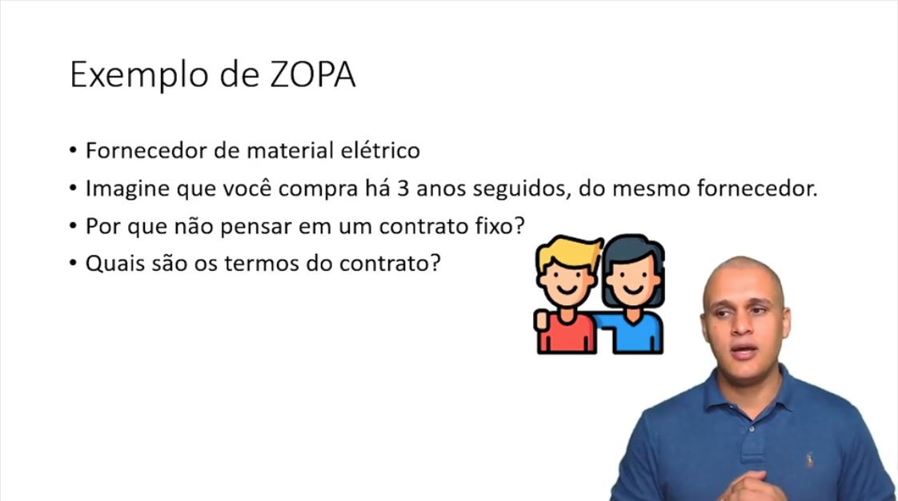
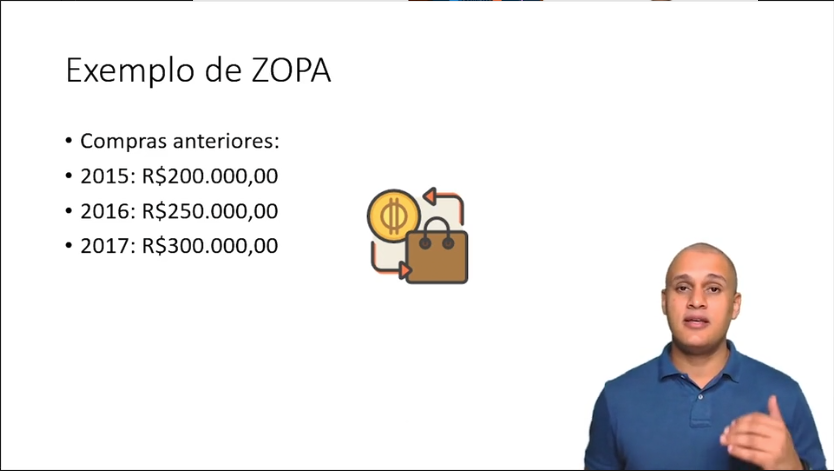
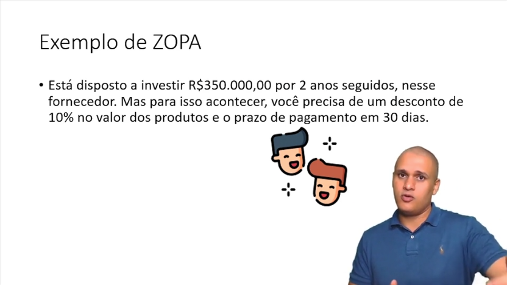
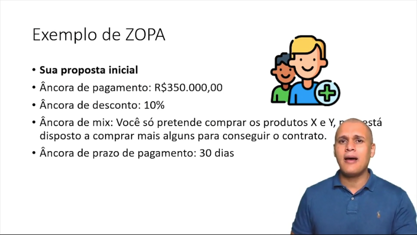
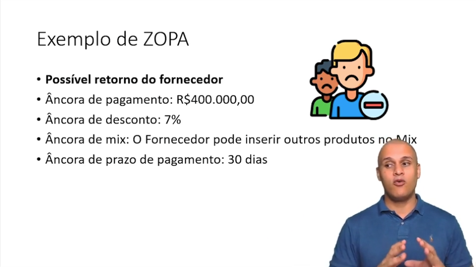
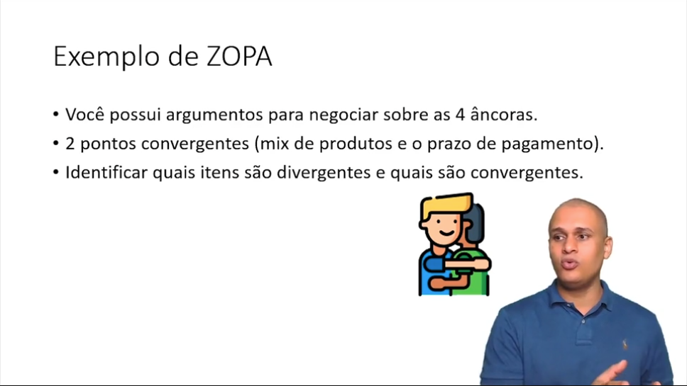
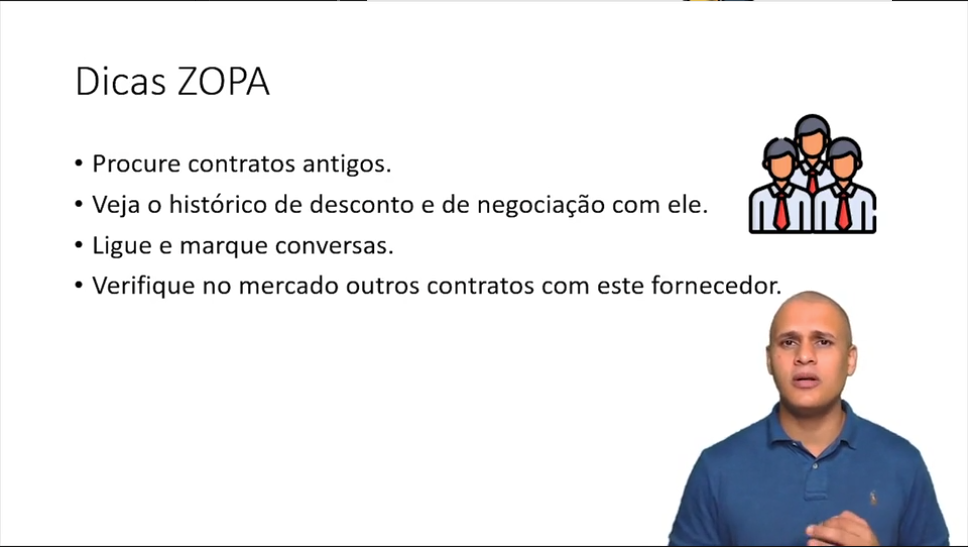
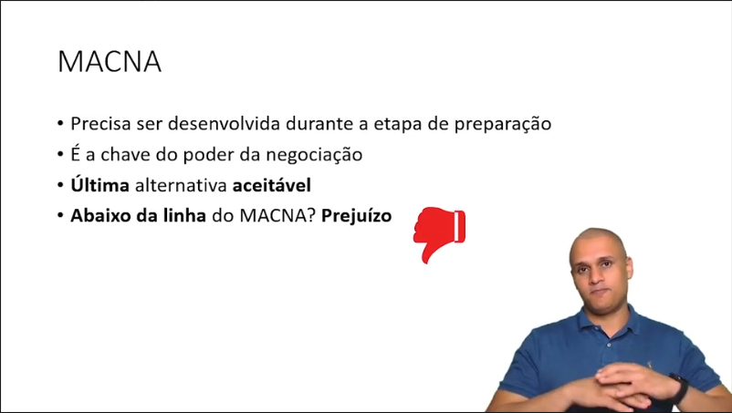
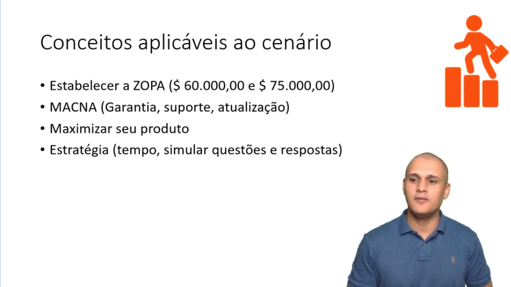

# 📚 Anotações sobre o curso NEGOCIAÇÃO - PRÁTICAS ESSENCIAIS

## Objetivo do Curso

---

## Definição de Negociação
- #### É o uso da informação e do poder
- #### Visa influenciar
- #### É um processo de comunicação, no mínimo, bilateral
- #### É uma decisão conjunta
- #### É uma forma de resolução de conflitos
- #### Toda negociação visa satisfazer necessidades

---

## Aplicação da Negociação
- Gestão de projetos
- Negociação de contratos
- Negócios comerciais
- Assuntos pessoais

---

## Tipos de Negociação
- ### Integrativa
    

- ### Distributiva
    

> ## Exemplo do bolo
> #### Eu quero dividir em partes iguai (integrativa) ou quero ficar com a maior fatia (distributiva)?

- ### Características do Negociador
    - Paciente
    - Persistência
    - Bom ouvinte
    - Decisivo
    - Comunicativo
    - Planejador/Estrategista
    - Domínio do produto que está negociando

---

## Definição de ZOPA

### ZOPA -> **ZO**na de **P**rovável **A**cordo

> ##### É quando um item de uma negociação é precebido como algo importante tanto para o fornecedor, como para o comprador.

---

## Definição MACNA

### MACNA -> **M**elhor **A**lternativa em **C**aso de **N**ão-**A**cordo

> ##### É um último recurso, um coelho tirado da cartola quando a outra parte se demonstra resistência para fechar o acordo

---

## Estabelecendo Prioridades

### Como se preparar para uma negociação?

1. #### Conhecer bem o produto
2. #### Estabelecer prioridades
3. #### Planejar bem
4. #### Buscar informações gerais da parte interessada
5. #### Marca pessoal ou da organização
6. #### O que e com quem irá negociar

---

## Elaborando a estratégia para uma negociação

### 1. Definir os limites
- Estabelecer limite desejável e mínimo
- Entender os limites da outra parte
- Estabelecer um ambiente de confiança
### 2. Desenvolver o MACNA
- Criar e simular alternativas
- Ter aprovação de possíveis soluções
- Criar benefícios diferenciais para facilitar o acordo
### 3. Considerar tempo adequado ao tipo de negociação
- Qual o tempo da negociação
- Qual a disposição da outra parte com a negociação
- Preparar-se mentalmente e psicologicamente
### 4. Criar possíveis cenários de questões e respostas
- Simular questões e respostas das outras partes
- Criar situações e cenários
- Explorar as convergências

---

## Etapas da Negociação

### 1. Planejamento e Preparação
- #### Necessário dedicação de tempo no planejamento
    - Pontuar pontos positivos e negativos
    - Estabelecer âncoras de negociação
- #### Mais atenção aos pontos comuns que aos pontos de conflitos
    - Direcionar o cliente para os pontos convergentes e afastar o foco dos pontos divergentes
- #### Considere alternativas que possam ser levadas em conta pela parte interessada
    - Reconhecer pontos de melhoria no produto baseado nas propostas do cliente
- #### Aprenda tudo que puder da outra parte
    - Busque conhecer o cliente e aproximá-lo cada vez mais

---

## Cenário do Curso

