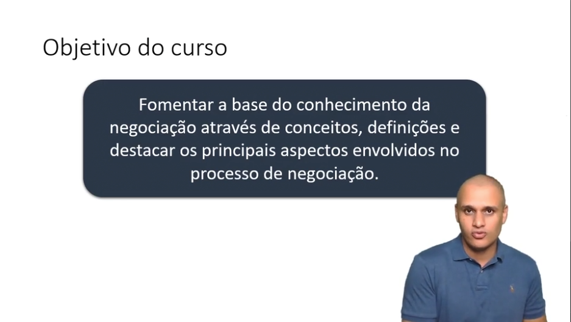
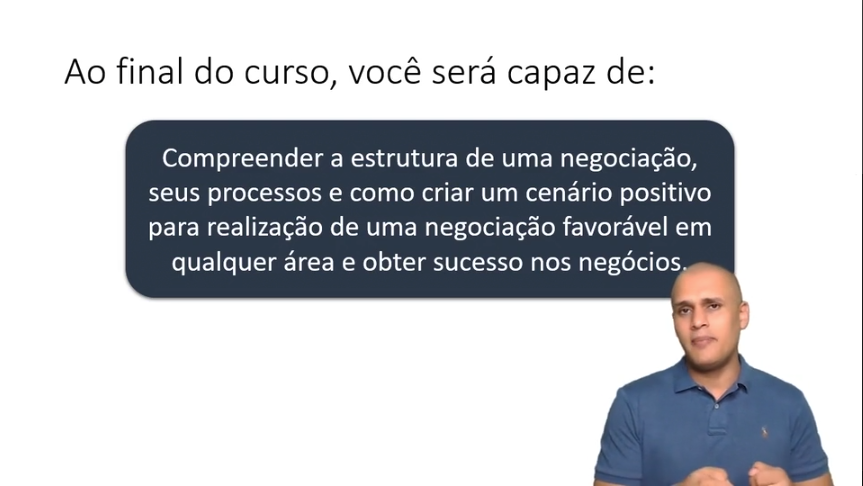
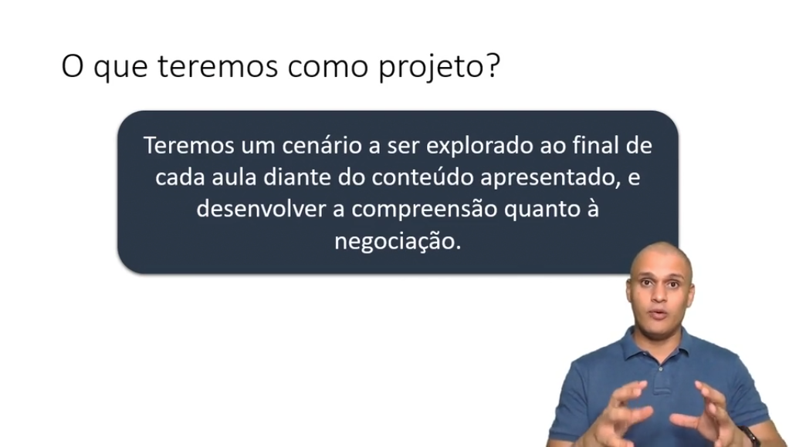
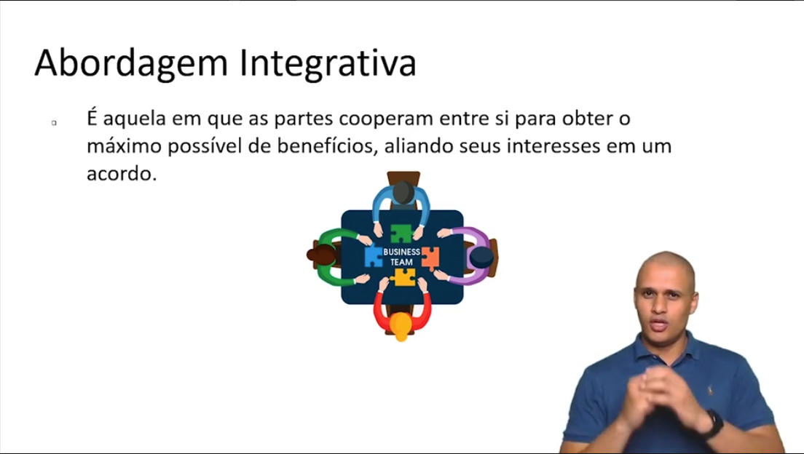
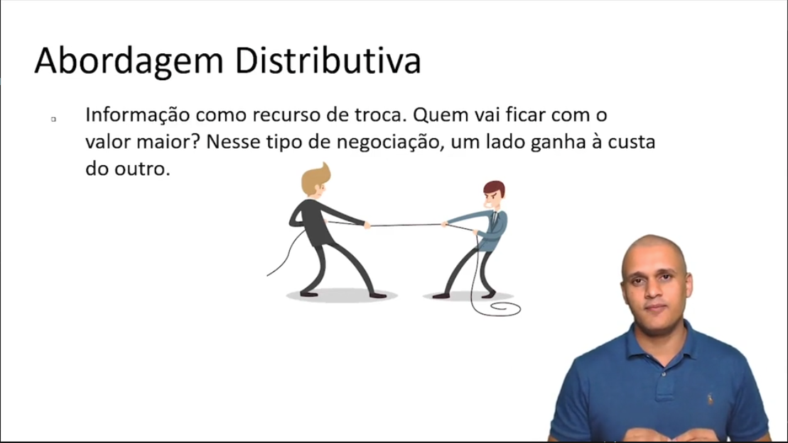
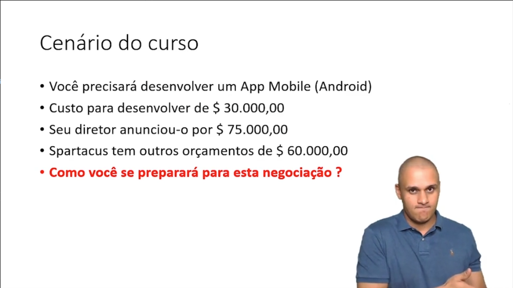

# 📚 Anotações sobre o curso NEGOCIAÇÃO - PRÁTICAS ESSENCIAIS

## Objetivo do Curso

---

## Definição de Negociação
- #### É o uso da informação e do poder
- #### Visa influenciar
- #### É um processo de comunicação, no mínimo, bilateral
- #### É uma decisão conjunta
- #### É uma forma de resolução de conflitos
- #### Toda negociação visa satisfazer necessidades

---

## Aplicação da Negociação
- Gestão de projetos
- Negociação de contratos
- Negócios comerciais
- Assuntos pessoais

---

## Tipos de Negociação
- ### Integrativa
    

- ### Distributiva
    

> ## Exemplo do bolo
> #### Eu quero dividir em partes iguai (integrativa) ou quero ficar com a maior fatia (distributiva)?

- ### Características do Negociador
    - Paciente
    - Persistência
    - Bom ouvinte
    - Decisivo
    - Comunicativo
    - Planejador/Estrategista
    - Domínio do produto que está negociando
---

## Cenário do Curso

---

## Definição de ZOPA

- ### ZOPA -> **ZO**na de **P**rovável **A**cordo
    - É quando um item de uma negociação é precebido como algo importante tanto para o fornecedor, como para o comprador.
    